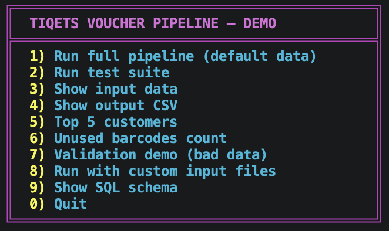
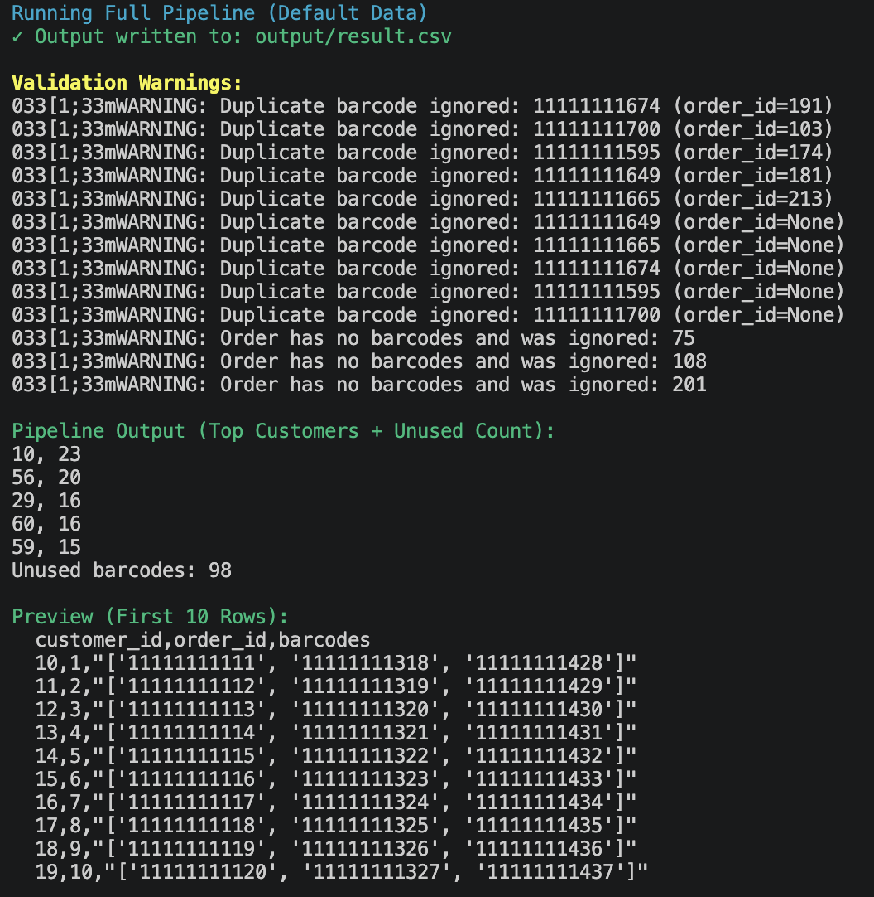
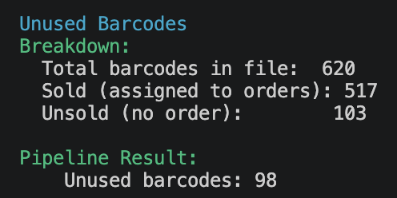
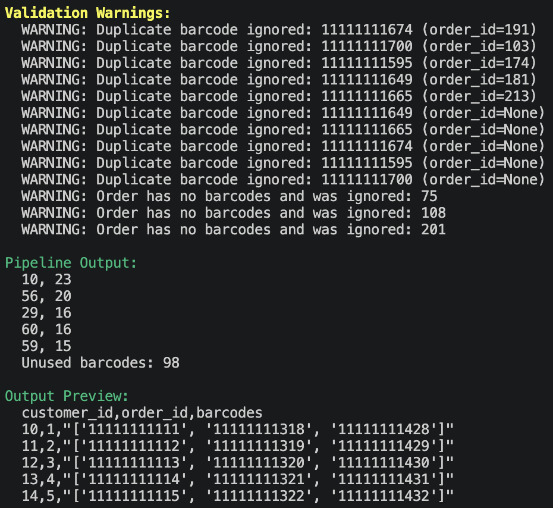

# tiqets-backend-assignment

## Assignment

The original brief, schema, and sample data are preserved in the `assignment/` folder for reference.

## Purpose

Build a pipeline that merges orders and barcodes into a voucher output CSV, validates input data, and reports key summary metrics.

## Quick Start

```bash
python3 -m venv .venv
source .venv/bin/activate
python -m pip install -r requirements.txt
bash scripts/demo.sh
```

## Requirements

- Python 3.11+
- Install dependencies with `python3 -m pip install -r requirements.txt`

## Interactive Demo



## Usage

```bash
python main.py --orders assignment/data/orders.csv --barcodes assignment/data/barcodes.csv --output output/result.csv
```

### End-to-End Pipeline



## How to Test

```bash
python -m pytest tests/ -v --tb=short
```

The CLI prints the top 5 customers by ticket count and the unused barcode count to stdout. Validation warnings are sent to stderr.

## Output Format

The output CSV contains one row per order:

```
customer_id,order_id,barcodes
10,1,"['11111111111', '11111111112']"
```

### Validation and Edge Cases



Validation errors (duplicate barcodes, missing barcodes, malformed rows) are logged to stderr and excluded from output. The unused barcode count is reported in stdout after the top-5 summary.

## SQL Model

The relational model is in `sql/schema.sql` and includes primary keys, foreign keys, and indexes.

### SQL Schema



This model uses three tables (customers, orders, barcodes) with foreign keys from orders to customers and from barcodes to orders. Indexes on customer_id and order_id support fast joins and lookups.

## Folder Structure

Top-level layout and purpose:

- `assignment/` — original brief and immutable source datasets
	- `Tiqets Assignment.pdf` — assignment brief
	- `data/` — original CSV copies (assignment snapshots)
- `data/` — working CSV copies used by the app and demo
- `docs/` — implementation documentation and screenshots
	- `architecture.md`, `data-flow.md`, `considerations.md`
	- `images/` — helpful screenshots referenced in the README
- `scripts/` — executable helper scripts (e.g., `demo.sh`)
- `sql/` — database model artifacts (`schema.sql`)
- `src/` — application code (models, readers, validators, processors, writers, reporter)
	- `src/models/`, `src/readers/`, `src/validators/`, `src/processors/`, `src/writers/`, `src/reporter/`
- `tests/` — test suite and fixtures
- `output/` — generated pipeline outputs (created by the app)
- `.gitignore`, `main.py`, `requirements.txt` — repo config and entrypoints

Notes:
- Keep `assignment/` immutable for auditing; work with `data/` for demo runs.
- `output/` is ignored by Git and intended as a local artifact directory.

## Deployment Plan

1. Create a virtual environment and install dependencies.
2. Run tests with `python -m pytest tests/ -v`.
3. Run the pipeline via `python main.py --orders <file> --barcodes <file> --output <file>`.
4. Or use the interactive demo via `bash scripts/demo.sh`.
5. Store outputs under `output/` and archive results as needed.

## Design Decisions

- Standard library only for parsing and processing.
- Readers, validators, processors, writers, and reporting are separated to keep concerns isolated.
- Validation logs invalid rows and excludes them from output.