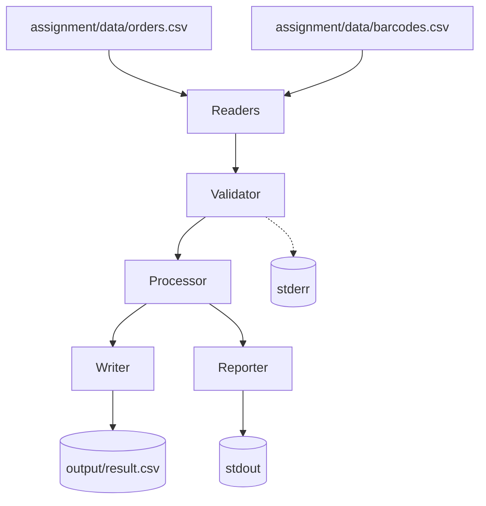

# Architecture

Purpose: Describe the voucher pipeline components, their responsibilities, and how they connect.

## Overview

The system is a linear voucher pipeline: it reads orders and barcodes, validates them, aggregates barcodes by order, writes the output CSV, and prints summary metrics. Each stage is in its own module to keep behavior explicit and testable.

## Components

| Component | File(s) | Responsibility |
|-----------|---------|----------------|
| CLI | main.py | Orchestrates the pipeline and handles user-facing errors |
| Readers | src/readers/*.py | Parse CSV rows into Order and Barcode models |
| Validator | src/validators/validator.py | Enforce no duplicates, no orders without barcodes, log warnings to stderr |
| Processor | src/processors/processor.py | Build per-order barcode lists and compute summaries |
| Writer | src/writers/output_writer.py | Write output CSV rows to disk |
| Reporter | src/reporter/reporter.py | Print top customers and unused barcode count |
| Demo UI | scripts/demo.sh | Interactive review menu with validations, top 5 summary, and output inspection |
| SQL Schema | sql/schema.sql | Relational model for customers, orders, and barcodes |

## Data Sources

- assignment/data: immutable baseline dataset from the brief
- data: working copy for local experimentation
- tests/fixtures: small deterministic CSVs for tests

## Diagram

## Why This Layout Works

- Validation failures are isolated to a single component and logged immediately.
- Aggregation only runs on clean data, keeping output deterministic.
- The CLI and demo script remain thin orchestrators instead of mixing logic.
