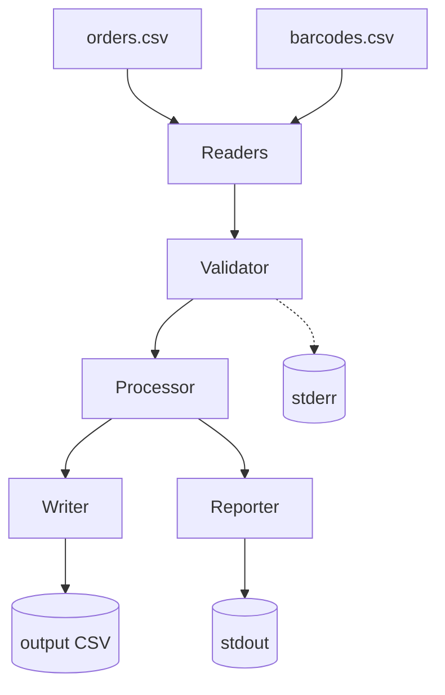

# Architecture

## Overview

This project runs a linear pipeline that reads order and barcode CSV files, validates them, and produces an output CSV with per-order barcode lists.
The flow is intentionally simple: each component owns one responsibility, keeping the pipeline easy to test and extend.

## Components

| Component | Responsibility |
|-----------|----------------|
| CLI (main.py) | Orchestrates the pipeline and prints summaries |
| Readers | Load raw CSV rows without domain validation |
| Validator | Enforce dataset rules and log validation failures |
| Processor | Build per-order barcode lists |
| Writer | Persist output CSV to disk |
| Reporter | Print top customers and unused barcode count |

## Diagram

## Why This Layout Works

- Validation failures are isolated to the validator and surfaced explicitly via stderr.
- Processing remains deterministic because invalid rows are removed before aggregation.
- The CLI only orchestrates calls, keeping IO, validation, and transformation decoupled.
