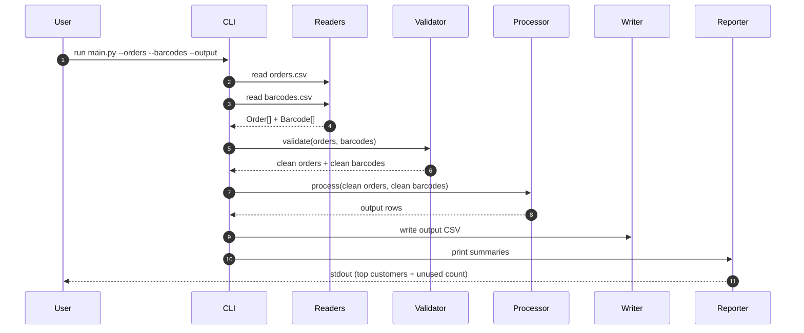
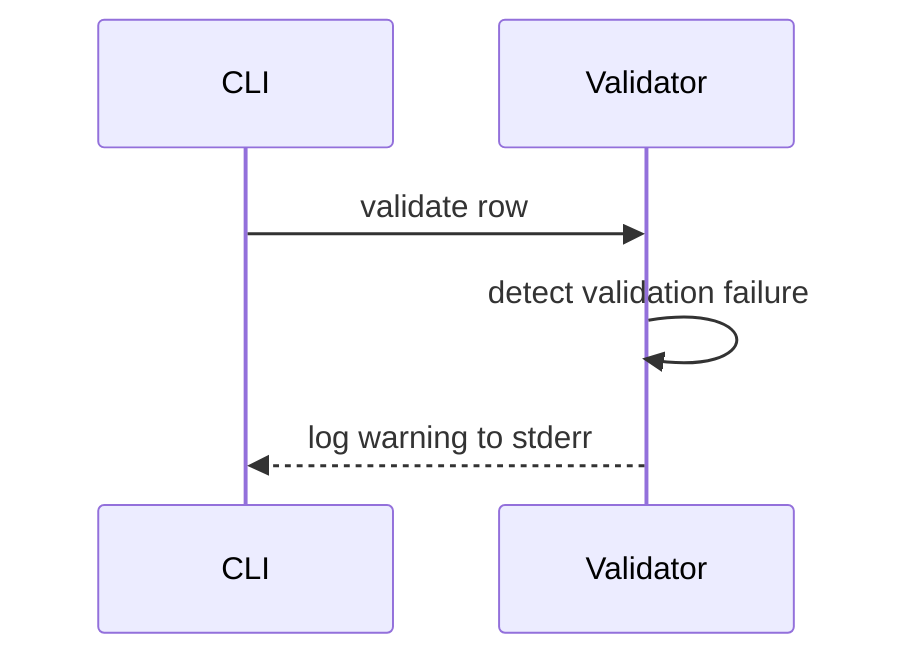

# Data Flow

Purpose: Show the end-to-end voucher pipeline flow, including validation and error handling.

## Voucher Pipeline

### Flow Description

The CLI receives paths for orders and barcodes. Readers parse CSV rows into Order and Barcode objects. The validator removes invalid rows (missing fields), removes duplicate barcodes, and drops orders with no barcodes while logging each issue to stderr. The processor aggregates barcodes per order, and the writer outputs a single CSV row per order. The reporter prints the fixed top 5 customers and unused barcode count to stdout.

### Step-by-Step Behavior

1. CLI loads orders.csv and barcodes.csv via OrderReader and BarcodeReader.
2. Validator filters malformed rows and logs warnings to stderr.
3. Validator removes duplicate barcodes and logs each duplicate.
4. Validator removes orders without barcodes and logs each removed order.
5. Processor groups barcodes by order and builds output rows.
6. Writer writes the output CSV to the requested path.
7. Reporter prints the top 5 customers and unused barcode count to stdout.

## Error Flow

### Error Handling Description

- Duplicate barcodes and malformed rows are logged and skipped.
- Orders with no barcodes are logged and excluded from output.
- File I/O errors propagate to the CLI and exit with a non-zero code.

### Error Response Contract

- Validation error example: "WARNING: Duplicate barcode ignored: 12345"
- Missing barcode example: "WARNING: Order has no barcodes and was ignored: 10"
