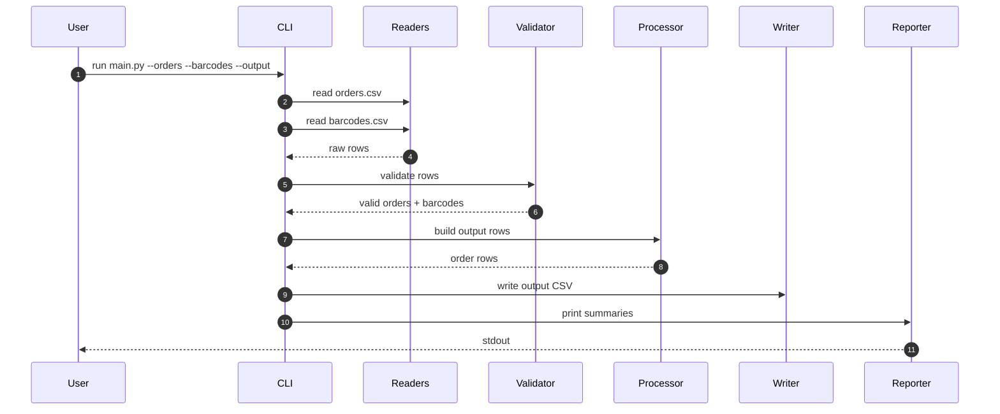
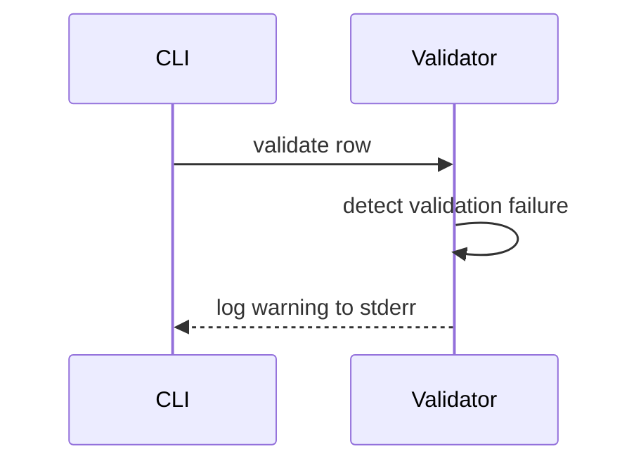

# Data Flow

## Voucher Pipeline

### Flow Description

The user invokes the CLI with orders and barcodes CSV paths. The pipeline loads raw rows, validates duplicates and missing barcodes, aggregates barcodes per order, writes the output CSV, and prints summary metrics.
Validation rules are enforced before aggregation so invalid rows never reach the processor or writer.

### Step-by-Step Behavior

1. CLI reads orders.csv and barcodes.csv via readers.
2. Validator normalizes rows, logs invalid items, and filters orders without barcodes.
3. Processor groups barcodes by order and produces output rows.
4. Writer persists the output CSV to disk.
5. Reporter prints top customers and unused barcodes to stdout.

## Error Flow

### Error Handling Description

- Validation errors (duplicate barcodes, missing barcodes, malformed rows) are logged to stderr and ignored.
- Orders without barcodes are logged and excluded from the output.
- IO errors bubble up to the CLI so failures are explicit.

### Error Response Contract

- Validation error example: "WARNING: Duplicate barcode ignored: 12345"
- Missing barcode example: "WARNING: Order has no barcodes and was ignored: 10"
